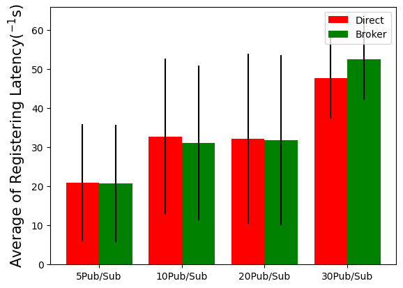
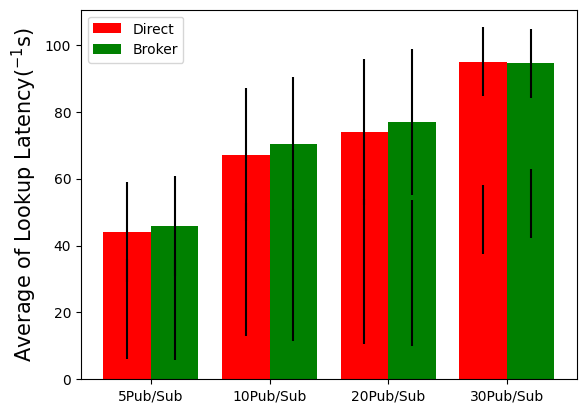

## This folder includes implementation of two ways of Pub-Sub for assignment2. We compare the register-latency/topic_look_up-latency of using these two ways to transfer message in different number of Publishers and Subscribers.

