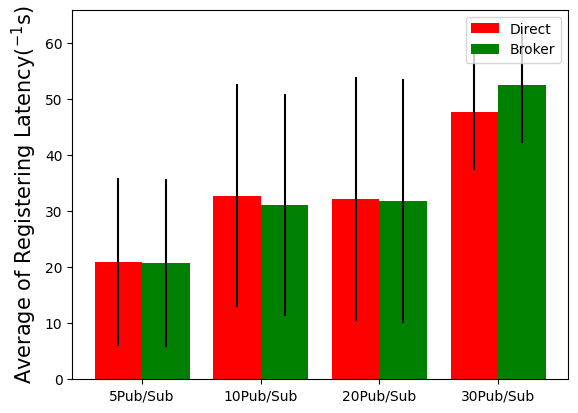
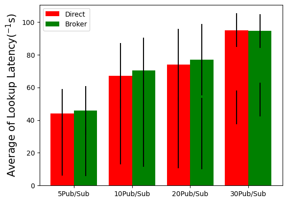

## This folder includes implementation of two ways of Pub-Sub for assignment2. We compare the register-latency/topic_look_up-latency of using these two ways to transfer message in different number of Publishers and Subscribers.

In the figures above, the x-axis represents the number of pub/sub we are running the experiment and the y-axis is the latency, we can see for both the registering latency and the look-up latency, as the number of sub/pub increases, the latency increases

